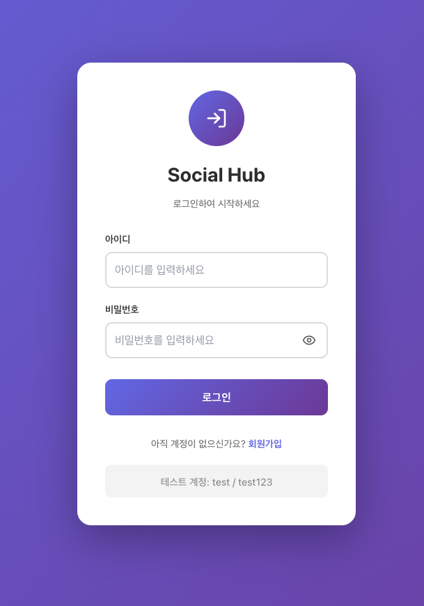
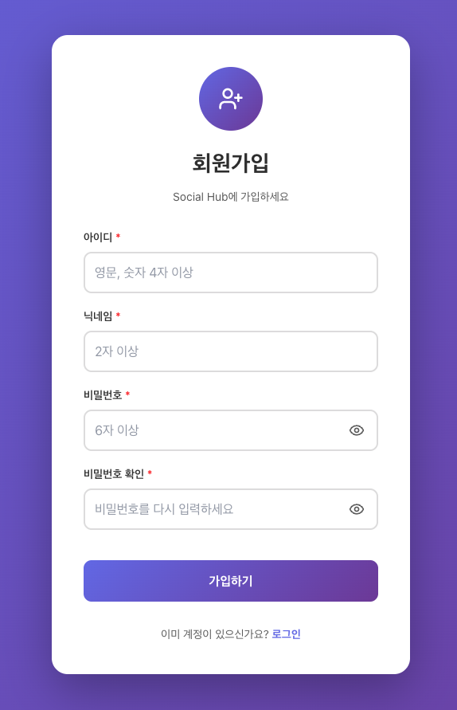
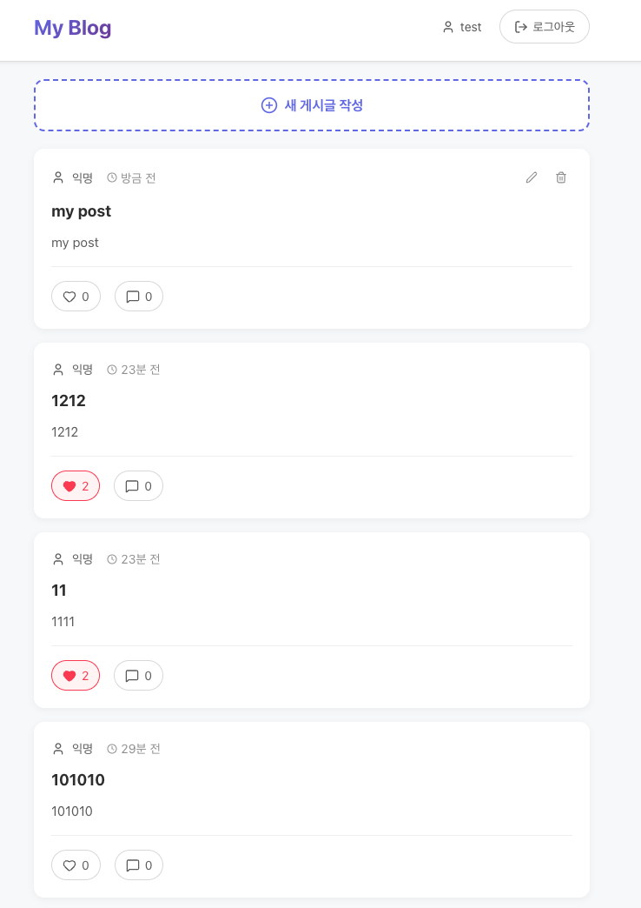
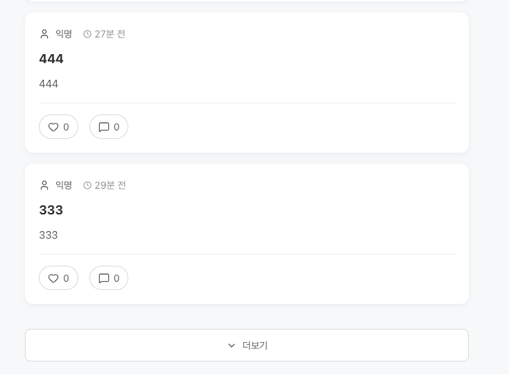
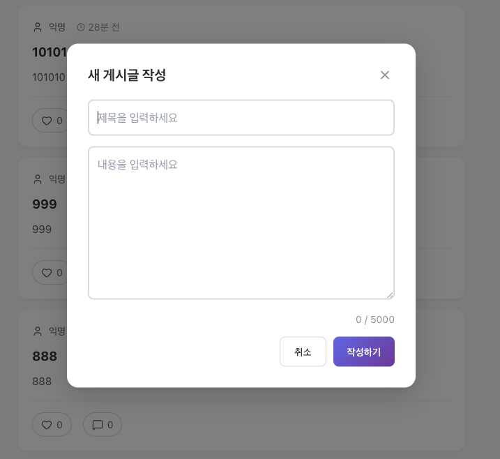
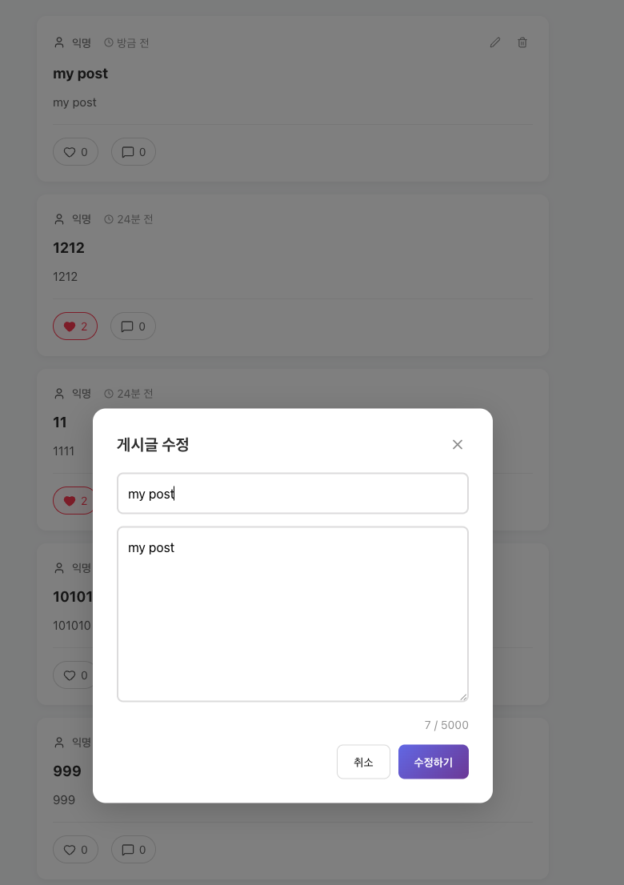
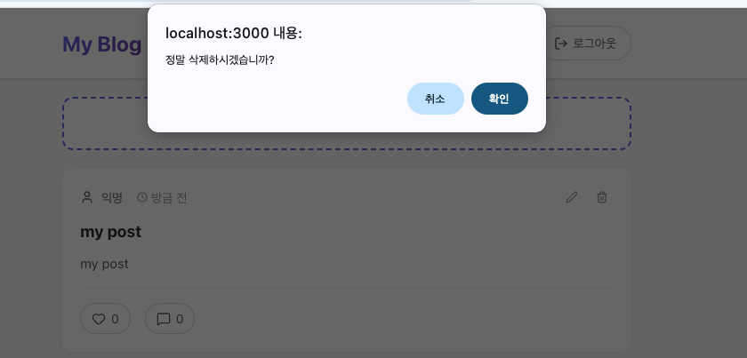

# Toy Blog Project
https://github.com/6th-PARD-SERVER-PART/Hyukjin_Choi_HW4_Toy_Blog

## 프로젝트 소개
PARD 서버 세미나 4번째 과제로 간단한 토이 블로그를 설계하였습니다.   
사용자가 게시글의 CRUD및 좋아요 기능을 사용할 수 있습니다.  
무한 스크롤 방식의 페이지네이션과 실시간 좋아요 업데이트를 구현하였습니다.

**📆 프로젝트 기간 : 2025.10.30 ~ 2025.10.31**

### 프로젝트 의의
해당 프로젝트의 주요의의는 백엔드 로직을 구현해놓으면,  
Claude Max로 짧은 기간 내 프론트를 구현할 수 있는가였습니다.

## 프로젝트 기술스택

**Frontend:**   
**Backend:**   
**Database:** 

## 프로젝트 주요 기능
- 로그인 페이지

  

- 회원가입 페이지

  

  

- 블로그 홈

  

  

  

  

- CRUD

  

  

  

## 프로젝트 후기
최근 인사이트 랩실 미팅에서 Claude Max로도 프론트 지식 없이 프론트엔드를 충분히 구현할 수 있다는 이야기를 들었습니다.  
React 경험은 전혀 없지만, Flutter + Spring Boot로 앱을 만들어본 경험이 있어
"AI의 도움으로 프론트를 직접 구현할 수 있지 않을까?" 라는 생각이 들었습니다.

이번 파드 과제 4는 그 가설을 실험해볼 좋은 기회였습니다.
저는 먼저 백엔드를 설계하고, 회원가입, 로그인, Post CRUD, Like 기능만 담은 가벼운 API 서버를 구축했습니다.
보안이나 시큐리티는 과감히 생략했습니다.

이후 Claude Max에게 프론트 코드를 받아,
라우팅과 세세한 API 호출 로직의 오류를 수정하며 MVP를 완성했습니다.
디자인이나 프론트 로직에 시간을 쓰지 않아도,
AI의 도움으로 빠르게 결과물을 만들어 낼 수 있었습니다.

이 과정을 통해 느낀 점은,
"만들면서 배운다"라는 학습 방식이 기존보다 훨씬더 강력한 학습 방식이 될고있다는 점입니다.
Claude가 생성한 자료는 단순한 결과물이 아니라,  
제가 이해하고 확장할 수 있는 최적의 학습자료 중 하나라고 생각이 듭니다.  
